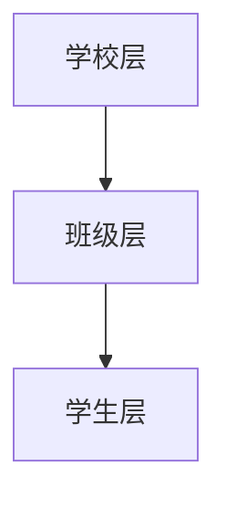

# 初始状态
{
### 预层范畴和层的解释

#### 生活示例

**生活中的层次结构**：想象一个学校的组织结构。学校可以被视为一个“层”，而在这个层中又有不同的“预层”，例如：

- **学校层**：整个学校作为一个整体。
  - **班级层**：每个班级作为一个子层。
    - **学生层**：班级中的每个学生。

在这个例子中，学校是一个层，而班级和学生则是预层。每个层次都有其特定的角色和功能。

#### Mermaid 图表

#### 概念映射表

| 概念       | 描述                                       |
|------------|--------------------------------------------|
| 层         | 整体结构的一个部分，具有特定的功能和角色。 |
| 预层       | 层中的子结构，进一步细分层的功能和角色。   |
| 例子       | 学校层、班级层、学生层                     |
| 关系       | 层包含预层，预层构成层的具体实现。         |

### 总结

- **层**是一个整体结构的组成部分，具有特定的功能。
- **预层**是层的细分，进一步定义了层的内部结构和功能。
- 通过生活中的例子、图表和概念映射，可以更清晰地理解这两个概念的关系和作用。
}
# 操作
把初始状态翻译成英语，注意学术用语
