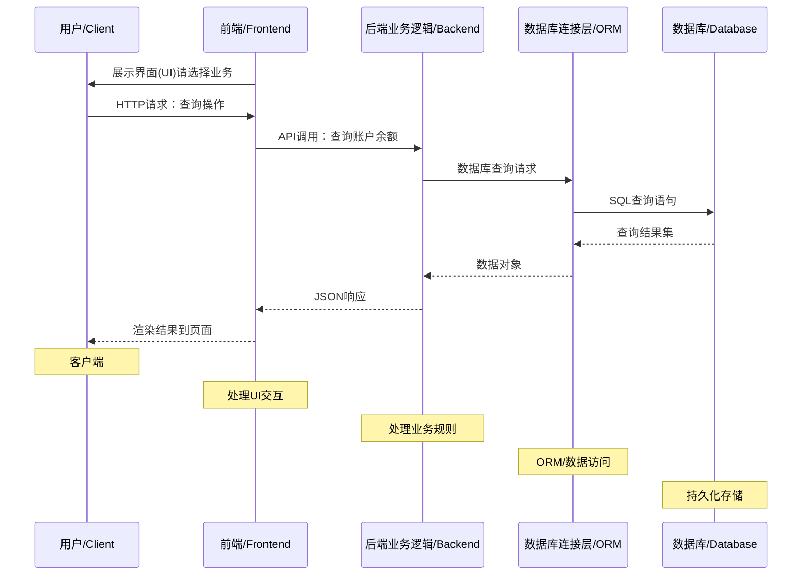

```mermaid
sequenceDiagram
    participant 用户 as 用户/Client
    participant 前台 as 前端/Frontend
    participant 财务 as 后端业务逻辑/Backend
    participant 记账 as 数据库连接层/ORM
    participant 账本 as 数据库/Database
    前台->>用户: 展示界面(UI)请选择业务
    用户->>前台: HTTP请求：查询操作
    前台->>财务: API调用：查询账户余额
    财务->>记账: 数据库查询请求
    记账->>账本: SQL查询语句
    账本-->>记账: 查询结果集
    记账-->>财务: 数据对象
    财务-->>前台: JSON响应
    前台-->>用户: 渲染结果到页面
    Note over 用户: 客户端
    Note over 前台: 处理UI交互
    Note over 财务: 处理业务规则
    Note over 记账: ORM/数据访问
    Note over 账本: 持久化存储
```
